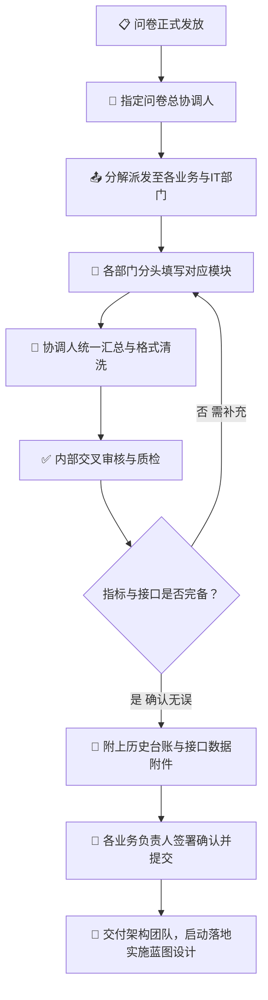

# 企业多智能体调研与宣贯方案

> 面向企业多智能体（Multi-Agent）系统部署的**前置调研与宣贯工作台**。
> 一份内容，三种用法：**给管理层讲**（15 页演讲台）、**给部门填**（10 维度标准问卷）、**给协同方看**（流程图），并支持**一键导出到 Google Slides** 与本地离线交付。

[](./LICENSE)
[](https://react.dev)
[](https://www.typescriptlang.org)
[](https://vite.dev)
[](https://firebase.google.com)

| 项目 | 说明 |
|---|---|
| 应用类型 | Google AI Studio 单页 Web 应用（React 19 + TypeScript + Vite 6） |
| 本地运行 | `npm install && npm run dev` → http://localhost:3000 |
| 目录 | `src/` 14 个源文件 · 约 **4,097 行** TS/TSX/CSS |
| 内容规模 | 15 页幻灯片（页页带逐字稿）· 10 部分 / 20 小节 / **78 个问卷问题** |
| 外部集成 | Firebase Auth（Google 登录）+ Google Slides API + Google Drive API |
| 方案版本 | V1.0 标准宣贯版 |

---

## 1. 这个项目解决什么问题

多智能体系统落地的失败，很少失败在技术上，而是失败在**开工之前**：

| 典型翻车 | 根因 |
|---|---|
| 方案做完了，业务部门说「不是我们要的」 | 调研问卷太笼统，问的全是「你们有什么痛点」 |
| 问卷发下去，收上来一堆空话 | 填报人不知道要写到什么颗粒度，也没有范例 |
| 管理层不理解为什么要花这笔钱 | 宣贯材料是技术文档，不是业务语言 |
| 跨部门填问卷互相推诿，拖了三周 | 没有单一接口人，没有责任认领表 |
| 数据收上来了，但 IT 接口能力没人问 | 问卷维度不全，漏了集成可行性 |

本项目把「开工前的那两周」做成了三个可直接使用的工作台，并让填完的结果能一键变成 Google Slides 汇报稿。

---

## 2. 三个工作台

顶栏切换，对应 `App.tsx` 的 `currentTab`：

| Tab | 值 | 组件 | 用途 |
|---|---|---|---|
| **演示宣贯** | `presentation` | `PresentationViewer.tsx` | 15 页高管汇报级 PPT + 逐字稿 |
| **信息采集问卷** | `questionnaire` | `QuestionnaireViewer.tsx` | 10 维度 78 问标准问卷，可查阅 / 检索 / 导出 |
| **流程图** | `workflow` | `MermaidWorkflow.tsx` | 四阶段填报协同流程（Mermaid 源码 + 可视化） |

---

## 3. 工作台一：15 页宣贯演讲

数据在 `src/data/slidesData.ts`（`SLIDES_DATA`，约 27 KB），**每页都带 `speakerNotes` 逐字稿**——这是给不熟悉技术的高管做汇报时最实用的部分。

| # | 分类 | 页型 | 标题 |
|---|---|---|---|
| 1 | 项目启动与定位 | `cover` | 企业多智能体系统部署 · 信息采集与现状调研宣贯方案 |
| 2 | 方案架构与目录 | `agenda` | 调研全景规划：从信息梳理到智能体方案落地 |
| 3 | 核心认知升级 | `compare` | 从「对话玩具」到「数字员工」：信息完备度决定智能体上限 |
| 4 | 调研全景架构 | `matrix` | 十维一体：全方位解码企业业务机理与数字基建 |
| 5 | 协同工作流 | `flow` | 权责清晰的填报工作流：非技术人员一目了然的四步闭环 |
| 6 | 模块 1 & 2 | `detail` | 摸清经营底牌与用户画像：让智能体找准服务对象 |
| 7 | 模块 3 | `detail` | 穿透业务肌理：找准数据堵点就是找准 AI 落地价值点 |
| 8 | 模块 4 | `detail` | 摸清 IT 接口能力与数据环境：决定智能体的集成路径 |
| 9 | 模块 5 | `pyramid` | 提取成文规则与隐性经验：让智能体学会「专业思考」 |
| 10 | 模块 6 & 7 | `split` | 筑牢安全堤坝，打通外部视野：稳健与敏锐兼备 |
| 11 | 模块 8 & 9 | `split` | 设计好用的人机协同闭环：尊重既有习惯与技术路线 |
| 12 | 模块 10 | `agenda` | 目标导向与边界约束：用可量化的商业价值定义成功 |
| 13 | 规范保障与质控 | `detail` | 规范填报与质量控制：拒绝「空话」与消除「顾虑」 |
| 14 | 推进计划与排期 | `gantt` | 清晰的推进节奏：10 个工作日高效交付全景问卷 |
| 15 | 结语与行动号召 | `conclusion` | 数字基建已就绪，携手迈入企业智能体集群新时代 |

### 10 种页型（`layout` 字段）

```
cover      封面          agenda     目录 / 要点罗列
compare    左右对比       matrix     维度矩阵
flow       流程步骤       detail     要点卡片
pyramid    金字塔层级     split      左右分栏
gantt      甘特时间线     conclusion 结论与行动项
```

页型由 `SlideData` 的 `layout` 字段驱动，每种页型消费不同的可选字段：

```ts
cards?           // 要点卡片：{ title, badge?, items[], type? }
table?           // 表格：{ headers[], rows[][] }
flowSteps?       // 流程步骤：{ step, label, desc, role, highlight? }[]
pyramidLevels?   // 金字塔层：{ level, title, desc, target }[]
timeline?        // 甘特时间线：{ day, phase, tasks[], owner }[]
highlightBanner? // 高亮横幅
speakerNotes     // 逐字稿（必填）
```

### 交互能力

| 操作 | 效果 |
|---|---|
| `→` / `PageDown` / `空格` | 下一页 |
| `←` / `PageUp` | 上一页 |
| `F` | 全屏（`requestFullscreen`） |
| 点击「复制逐字稿」 | 把当前页 `speakerNotes` 写入剪贴板 |
| 「下载全套讲稿到本地」 | 导出全部 15 页讲稿为 Markdown |

---

## 4. 工作台二：10 维度信息采集问卷

数据在 `src/data/questionnaireData.ts`，分两部分导出：

- `QUESTIONNAIRE_METADATA` —— 标题 / 版本 / 阶段 / 周期 / **保密声明** / 填写须知（5 条）
- `QUESTIONNAIRE_SECTIONS` —— 10 部分 / 20 小节 / 78 个问题

### 10 个维度

| 部分 | 标题 | 小节 |
|---|---|---|
| 一 | 企业基本信息 | 1.1 企业概况 · 1.2 数字化转型现状 |
| 二 | 组织架构与人员现状 | 2.1 组织架构与流转路径 · 2.2 人员画像（系统使用者） |
| 三 | 各业务板块数据详情 | 3.1 业务板块清单与运营模式 · 3.2 各板块具体数据（分板块实操深潜） |
| 四 | 现有 IT 系统与技术环境 | 4.1 系统清单与接口能力 · 4.2 网络、硬件与数据治理 |
| 五 | 具体业务规则与流程 | 5.1 核心业务流程与经验依赖 · 5.2 规则体系（以康源美宏 213 项标准为例） |
| 六 | 外部数据与政策信息 | 6.1 政策监控与对标需求 · 6.2 外部 API 与数据集成 |
| 七 | 合规与安全要求 | 7.1 数据合规红线 · 7.2 系统安全与连续性 |
| 八 | 用户交互与体验偏好 | 8.1 访问端与报表呈现 · 8.2 多级告警与事件响应 |
| 九 | 技术约束与集成偏好 | 9.1 底层模型与技术栈偏好 · 9.2 集成优先级与运维支持 |
| 十 | 预算与时间期望 | 10.1 预算总盘与时间里程碑 · 10.2 成功量化标准与验收流程 |

### 问题结构

```ts
interface QuestionnaireQuestion {
  question: string;     // 问题本身
  explanation: string;  // ★ 必填——说明这一问到底在问什么
  example?: string;     // 参考范例（21 个问题带范例）
}
```

**`explanation` 是必填字段**，这是本问卷与「随便列几个问题」的核心差别：每一问都告诉填报人它的**意图与口径**，而不是只丢一个标题。

例如：

| 问题 | explanation | example |
|---|---|---|
| 分支机构数量 | 含子公司、分公司、直营机构等 | 7 家机构（西安 4 家、成都 2 家、云南曲靖 1 家）+ 30 余个日间照料中心 |
| 年营收规模 | 尽可能提供近一年数据或区间 | 约 X 亿元 |
| 数据标准化程度 | 各系统间数据格式是否统一？是否存在「数据孤岛」？ | 各机构运营数据格式未统一，存在数据孤岛 |

> 部分小节还带 `exampleData`（示例表格），用真实表格展示「填成什么样才算合格」。

### 查阅能力

- **全文检索**：顶栏搜索框支持按维度、问题、指标、示例关键词定位（如 `康源`、`API`、`SOP`）
- **全量 Markdown 导出**：一键复制到剪贴板，或下载 `.md`

### 保密声明（`confidentialStatement`）

> 本问卷所涉及的企业数据（包括但不限于组织架构、运营数据、财务信息、人员信息等）仅用于本次多智能体系统方案设计。未经贵方书面许可，不得向任何第三方披露或在其他项目中使用。所有数据在方案交付后将进行加密归档或按约定销毁。

---

## 5. 工作台三：协同流程图

`MermaidWorkflow.tsx` 内置两份数据：

1. **`RAW_MERMAID`** —— Mermaid `graph TD` 源码，10 个节点，含一个**回退分支**（质检不通过回到填报）：



2. **`STEPS`** —— 9 个步骤节点，每步携带**责任角色 / 阶段 / 交付物 / 风险提示**四要素：

```ts
interface StepNode {
  id: string;            // 'A' ~ 'J'
  code: string;          // 'STEP 01'
  title: string;
  role: string;          // 谁负责
  desc: string;
  phaseId: 'phase1' | 'phase2' | 'phase3' | 'phase4';
  phaseName: string;
  deliverable: string;   // 产出什么 ← 最重要
  riskNote: string;      // ★ 这一步容易怎么翻车
}
```

### 四个阶段与 9 个步骤

| 阶段 | 步骤 | 责任角色 | 交付物 |
|---|---|---|---|
| **一 启动与派发** | STEP 01 问卷正式发放 | 项目筹备组 / 数字化推进办 | 全套问卷模板、部门填报任务清单 |
| | STEP 02 指定单一问卷总协调人 | 分管高管 / 数字化办公室总监 | 总协调人任命通知与联络方式 |
| | STEP 03 分解派发至各业务与 IT 部门 | 问卷总协调人 | 10 大模块责任认领表（附录 B） |
| **二 分布式填报** | STEP 04 各部门并行精细化填报 | 各业务骨干 / 系统开发与运维组 | 各部门分卷初稿与疑问台账 |
| **三 审核与质检** | STEP 05 统一汇总与跨模块口径清洗 | 问卷总协调人 | 合并清洗版全景问卷草案 |
| | STEP 06 内部交叉审核与完整性核查 | 各业务线负责人 + IT 总监 | 审核通过意见书（或驳回补充清单） |
| | STEP 07 附上历史台账与接口数据附件 | 各部门对接人 | 标准化附件压缩包与索引清单 |
| **四 提交与转化** | STEP 08 各业务长签字知悉并正式提交 | 各业务长 + 协调人 + 数字化分管高管 | 签署版《调研问卷全案》及全部附件 |
| | STEP 09 交付架构团队，启动实施方案设计 | 多智能体解决方案架构团队 | 《企业多智能体落地实施蓝图与 ROI 评估报告》 |

**`riskNote` 是本模块最有价值的设计**——它把「这件事会怎么搞砸」直接写在流程图上。例如：

> **STEP 02**：*切忌多头汇报或未设总接口人，否则跨部门协作极易出现责任真空与推诿。*
>
> **STEP 01**：*必须同步附带高管宣贯讲话要点，避免被业务部门当作普通例行公事而忽视。*

页面提供「一键复制 Mermaid 源码」，可直接粘到支持 Mermaid 的文档工具（飞书 / Notion / Obsidian / GitHub）里复用。

---

## 6. Google Slides 一键导出

**这是本仓库被称为「谷歌应用」的原因**——它真的会调 Google 的 API 帮你生成一份在线演示文稿。

### 6.1 授权

`src/services/auth.ts` 用 Firebase Auth + Google 登录，**在 OAuth 时额外申请两个作用域**：

```ts
provider.addScope('https://www.googleapis.com/auth/presentations'); // Google Slides 读写
provider.addScope('https://www.googleapis.com/auth/drive.file');   // 对本应用创建的文件读写
```

`provider.setCustomParameters({ prompt: 'select_account' })` —— 每次登录都让用户选账号，方便多账号切换。

### 6.2 导出链路

`src/services/slidesExport.ts` → `exportToGoogleSlides(accessToken, slides, onProgress)`：

```text
1. POST https://slides.googleapis.com/v1/presentations
   body: { title: "企业多智能体系统（Multi-Agent）部署 · 信息采集与现状调研宣贯方案" }
   → 拿到 presentationId、presentationUrl
   进度 10% → 25%

2. 分块 batchUpdate（CHUNK_SIZE = 5，15 页共 3 块）
   POST .../presentations/{id}:batchUpdate
   每块内先 createSlide（objectId = `slide_mas_${slide.id}`），
   再按 layout 分别灌入 cards / flowSteps / pyramidLevels / table / timeline 文本
   
3. 清理默认空白页
   POST .../presentations/{id}:batchUpdate
```

**为什么分块**：Slides API 的 `batchUpdate` 请求体有大小上限，15 页一次性提交容易被拒。按 5 页一切是稳定性与请求数的折中。

**进度反馈**：`ExportProgress` 通过 `onProgress` 回调持续上报 `{ step, percent, presentationId, presentationUrl }`，`GoogleSlidesExportModal` 实时渲染进度条；成功后直接给出演示文稿直达链接。

### 6.3 失败处理

- 未登录 → 弹窗内引导先登录 Google 账号（`onRequireLogin`）
- 创建失败 → 把 `status + 原始响应文本` 一并抛出，便于排查（如作用域未授权、配额超限）
- 导出失败 → 弹窗内展示错误信息并提供「重试」

---

## 7. 本地导出（三条通道 + 源码包指引）

`DownloadLocalModal.tsx` 提供 4 个选项：

| 选项 | 产物 | 用途 |
|---|---|---|
| 1 | 问卷 Markdown（`.md`） | 发给各部门填报 / 灌进知识库 |
| 2 | 幻灯片与逐字稿 Markdown（`.md`） | 打印成讲稿，或改成别的模板 |
| 3 | **单文件离线完整网页（`.html`）** | 内网电脑 / 无 Node 环境，双击即开 |
| 4 | 全源码 ZIP | 不做下载，而是给出 AI Studio 的 `Export → Download ZIP` 三步指引 |

所有下载走同一个实现：

```ts
const triggerDownload = (content: string, filename: string, mimeType: string) => {
  const blob = new Blob([content], { type: `${mimeType};charset=utf-8;` });
  const url = URL.createObjectURL(blob);
  // 临时 <a> 触发下载后 revokeObjectURL
};
```

---

## 8. 技术架构

```text
src/
├── main.tsx                    入口
├── App.tsx                     顶层：tab 状态 + Firebase 登录态 + 两个弹窗开关
├── index.css                   Tailwind + 字体与主题变量
├── types.ts                    SlideData / QuestionnaireSection 等类型
│
├── components/
│   ├── Navbar.tsx              顶栏：三 Tab 切换 + 登录态 + 导出/下载入口
│   ├── PresentationViewer.tsx  15 页演讲台（约 35 KB，含键盘导航 / 全屏 / 逐字稿）
│   ├── QuestionnaireViewer.tsx 问卷查阅（约 22 KB，含搜索 / Markdown 导出）
│   ├── MermaidWorkflow.tsx     流程图（Mermaid 源码 + 步骤卡片 · 约 18 KB）
│   ├── GoogleSlidesExportModal.tsx  导出进度弹窗（约 10 KB）
│   └── DownloadLocalModal.tsx  本地导出弹窗（约 21 KB）
│
├── data/                       内容层
│   ├── slidesData.ts           15 页幻灯片（约 27 KB）
│   └── questionnaireData.ts    10 部分 78 问（约 19 KB）
│
└── services/
    ├── auth.ts                 Firebase Auth + Google OAuth（含 Slides/Drive 作用域）
    └── slidesExport.ts         Google Slides API 导出链路（约 12 KB）
```

**分层原则**：`data/` 存内容，`services/` 存外部集成，`components/` 存呈现。`slidesData.ts` 同时被演示组件、Slides 导出器、Markdown 导出器三方消费——**内容是单点真源**。

---

## 9. 快速开始

### 9.1 本地运行

```bash
npm install
npm run dev        # http://localhost:3000
npm run lint       # tsc --noEmit
npm run build      # vite build → dist/
```

> 三个工作台（演讲 / 问卷 / 流程图）与本地导出**全部离线可用**，不登录也能跑。
> 只有「导出到 Google Slides」需要登录 Google 账号。

### 9.2 环境变量

```bash
cp .env.example .env
```

| 变量 | 说明 | 当前是否需要 |
|---|---|---|
| `GEMINI_API_KEY` | Gemini API 密钥（AI Studio 运行时自动注入） | **不需要**——源码中无模型调用 |
| `APP_URL` | 应用自身 URL（回链 / OAuth 回调） | 可选 |

### 9.3 Firebase 配置

`firebase-applet-config.json` 由 AI Studio 在创建应用时自动生成并提交入库：

```json
{
  "projectId": "red-archive-507800-r0",
  "authDomain": "red-archive-507800-r0.firebaseapp.com",
  "oAuthClientId": "272635949690-qajufreo80glm8vd1g5p6j3omb2bci4c.apps.googleusercontent.com"
}
```

> 若要在**自己的** Firebase 项目下运行，需替换此文件为自有项目配置，并在 Google Cloud Console 里为 OAuth 客户端启用 **Google Slides API** 与 **Google Drive API**，把本站域名加入授权来源。详见 [docs/04-认证授权与安全说明.md](docs/04-认证授权与安全说明.md)。

---

## 10. 二次开发指引

| 想改什么 | 改哪个文件 |
|---|---|
| 幻灯片文案 | `src/data/slidesData.ts` |
| 讲稿（逐字稿） | `src/data/slidesData.ts` 各页 `speakerNotes` |
| 问卷题目 / 范例 | `src/data/questionnaireData.ts` |
| 保密声明 / 填写须知 | `questionnaireData.ts` → `QUESTIONNAIRE_METADATA` |
| 流程图节点 | `MermaidWorkflow.tsx` → `RAW_MERMAID`（图）+ `STEPS`（卡片，两边要同步改） |
| 新增一种页型 | `types.ts` 的 `layout` 联合类型 + `PresentationViewer.tsx` 加渲染分支 + `slidesExport.ts` 加对应灌入逻辑 |
| Slides 导出行为 | `src/services/slidesExport.ts` |
| OAuth 作用域 | `src/services/auth.ts` |

---

## 11. 文档索引

| 文档 | 内容 |
|---|---|
| [docs/01-三个工作台.md](docs/01-三个工作台.md) | 各工作台的数据结构、页型映射与交互细节 |
| [docs/02-Google-Slides-导出链路.md](docs/02-Google-Slides-导出链路.md) | OAuth 授权、API 调用、分块策略、失败排查 |
| [docs/03-数据层与问卷规范.md](docs/03-数据层与问卷规范.md) | `slidesData` / `questionnaireData` 字段语义与扩写规范 |
| [docs/04-认证授权与安全说明.md](docs/04-认证授权与安全说明.md) | Firebase 配置、密钥性质、令牌生命周期、生产化建议 |
| [docs/05-本地开发与部署.md](docs/05-本地开发与部署.md) | 环境、命令、构建与部署选项 |
| [CHANGELOG.md](CHANGELOG.md) | 版本变更记录 |

---

## 12. 已知限制（诚实记录）

| 项 | 说明 |
|---|---|
| **无状态持久化** | 应用不使用 `localStorage` / URL hash 记录当前页码与 Tab。刷新会回到第 1 页、默认 Tab。 |
| **`@google/genai` / `motion` 已声明未使用** | AI Studio 模板遗留依赖，当前零模型调用、零动画库。`package.json` 的 `clean` 脚本引用的 `server.js` 也不存在。 |
| **Slides 导出无断点续传** | 中途失败会留下一个已创建的空演示文稿，需手动删除后重试。 |
| **流程图双源** | `RAW_MERMAID`（图）与 `STEPS`（卡片）是两份独立数据，改流程需同时改两处。 |
| **`index.html` 的 `lang` 曾为 `en`** | 内容全为中文。已在本次文档补齐中改为 `zh-CN`。 |
| **Firebase 配置中的 API Key 是公开客户端密钥** | Firebase Web API Key 按设计可公开，安全性由 Firebase 安全规则与 OAuth 授权的来源白名单保证，**不依赖该密钥保密**。但仍建议按 04 篇建议收紧 API 限制。 |
| **无自动化测试** | 目前依赖 `tsc --noEmit` 与人工验证。 |
| **内容与康源集团强绑定** | 部分示例含真实企业信息，对外分发前请评估脱敏。 |

---

## 13. 许可

MIT License — 见 [LICENSE](./LICENSE)。

---

_方案版本 V1.0 标准宣贯版_
